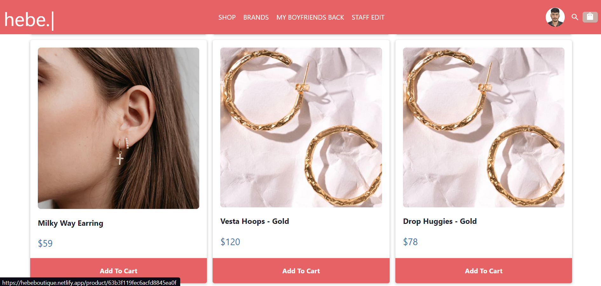
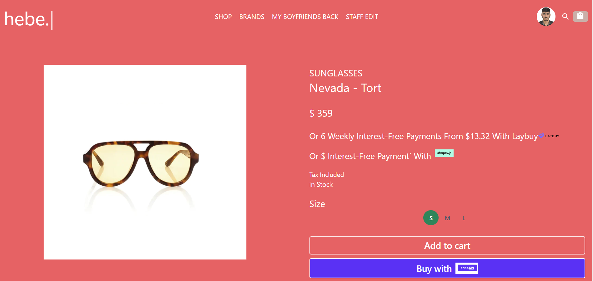
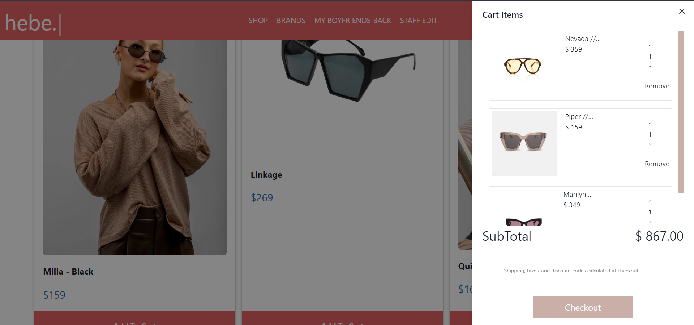
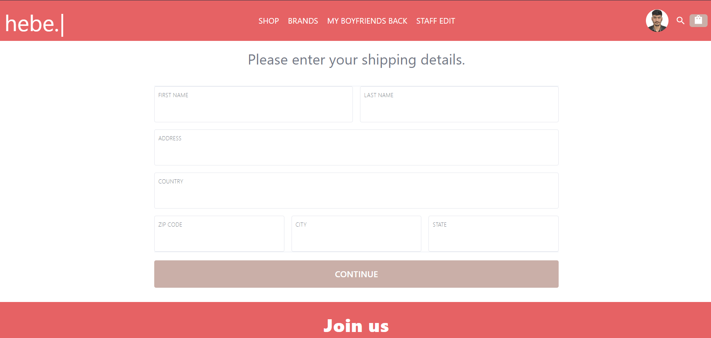
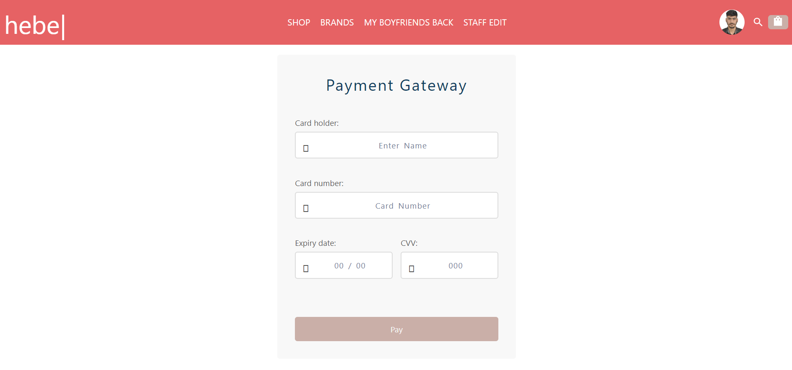

# Hebe Boutique Full Stack 
Hello everyone,. In this project, we were a team of 5members including Mohit Indoriya , Ankit Rana ,Hardeep Siwach ,Abhishek Patra and Priyanka Chejera . We have completed this project in 5 days.

# Technologies used:
In making this project, we used Html, Css, advanced JavaScript, React, Redux, Context API, Chakra UI ,mongodb,Express ,Node.js.

# Tasks Done:
We have assigned our tasks equally in the team. For example, landing page was created by Priyanka Chejera. Login of User and Admin Section  was created by Mohit Kumar Indoriya.Google Oauth is done by Abhishek patra , Cart  and Checkout was created by AnKit Rana  and Product and Product Details  was created by Hardeep Siwach.

# Features:
# Landing page:
 

 
The above page consists of navbar in which all the important links to our website is given.

 

 
The above screenshot consists of the slider in which different categories of products links are there .

 

 

# Product Category page:

 

 

In product page, user can buy any of the items by adding it in the cart. User can also see the details of that particular product by clicking on particular product.

# Product Details Page:
 

 

In these pages , user can view the details of the particular product, and select the size accordingly and then add to the cart.

# Cart page:

 

 

In the Cart page, we have the list of the items that we added to the cart and can change the quantity here on , can increase or decrease the quantity, and price changes accordingly.

# Payment page:
 

 

In payment page, there  user get   credit card or debit card option for payment and after filling all the correct details his payment will be done and he will be redirected to Landing page.
 
There is one admin section also that is only accesable by admin .for admin panel admin have to give a route admin and after that he have to give admin's credentials 
after that admin can  add new products and see all order placed at website .

This is a brief summary of our project. It was a great experience doing this project. We have learnt so many things in making the project. This would not have been possible without the team support. All the team members were so supportive and co-operative. Special thanks to all our Instructors and mentors who guided us so well.
